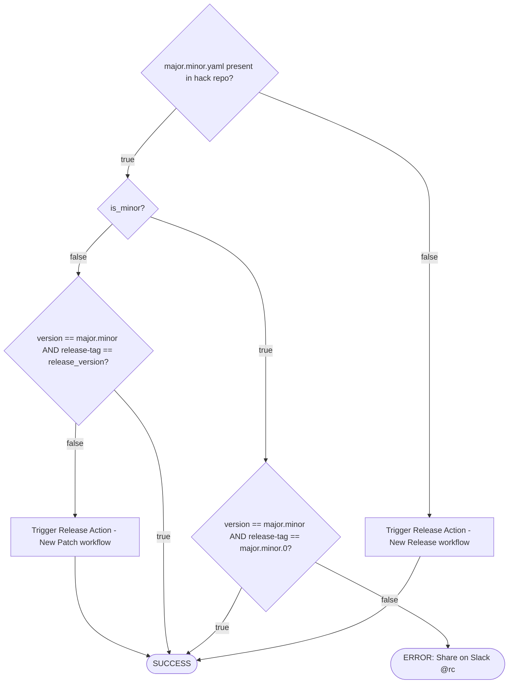
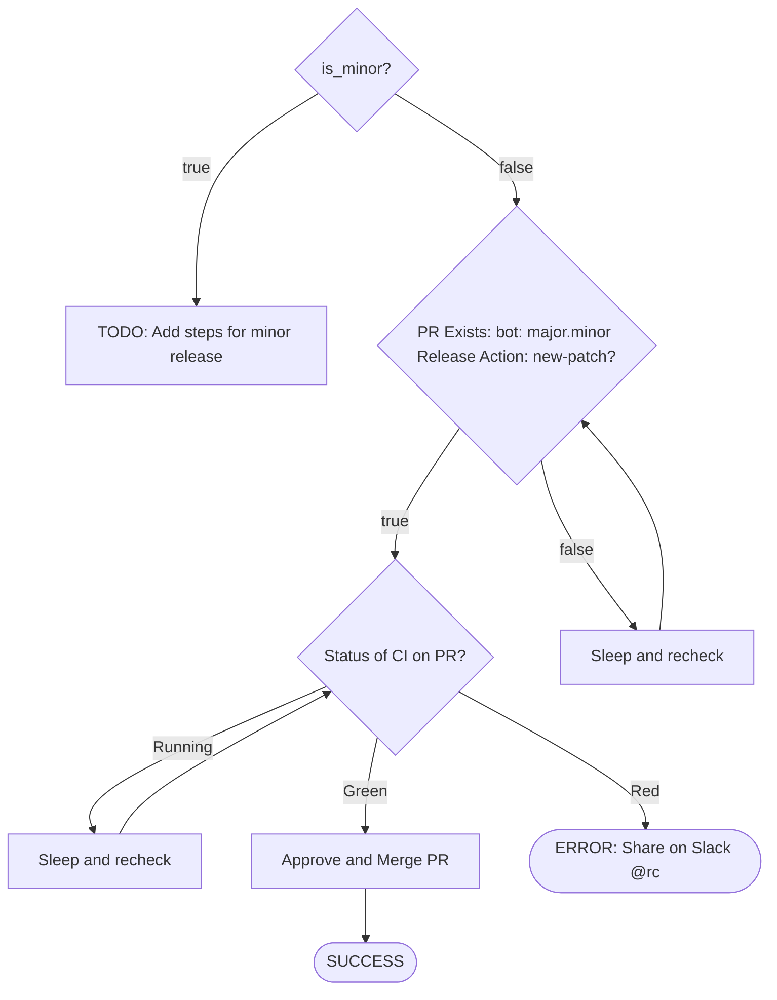
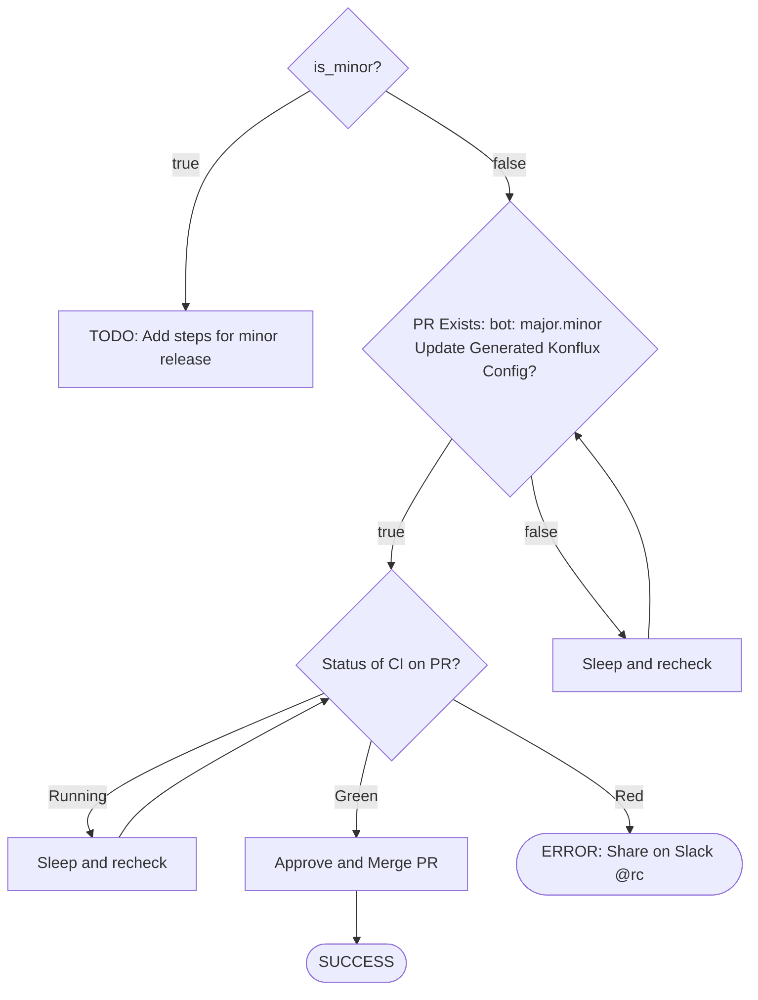
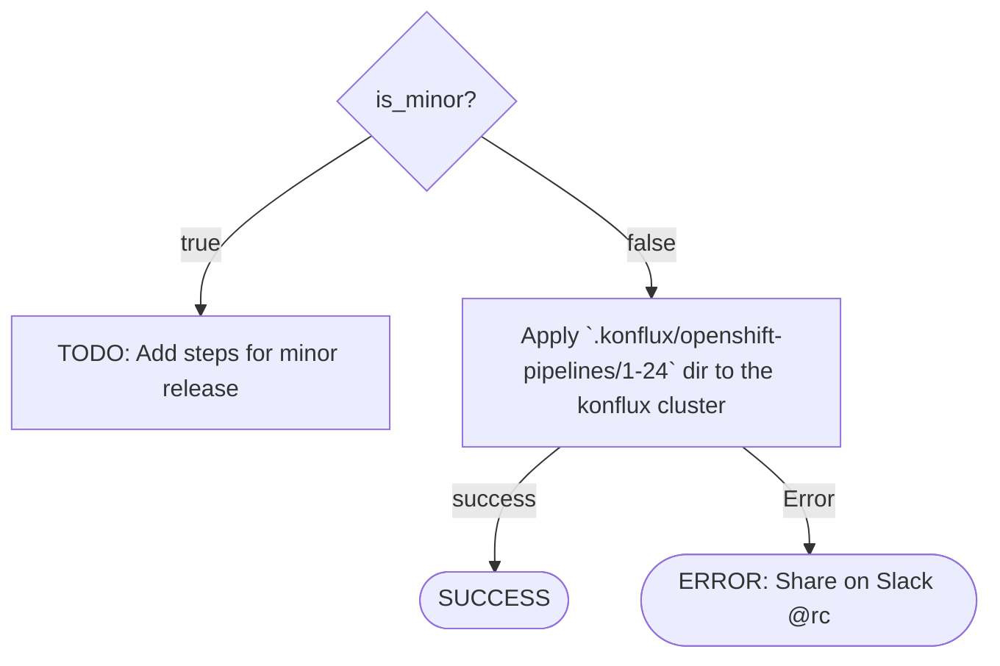
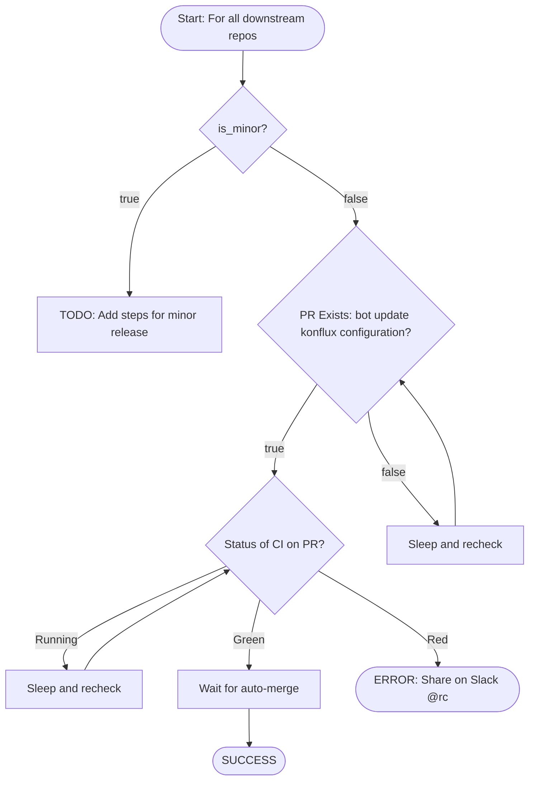
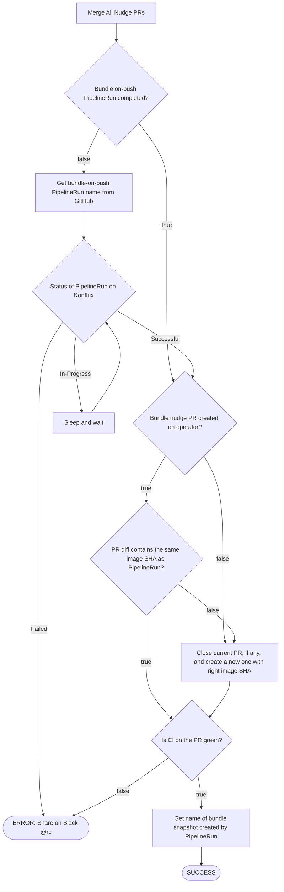
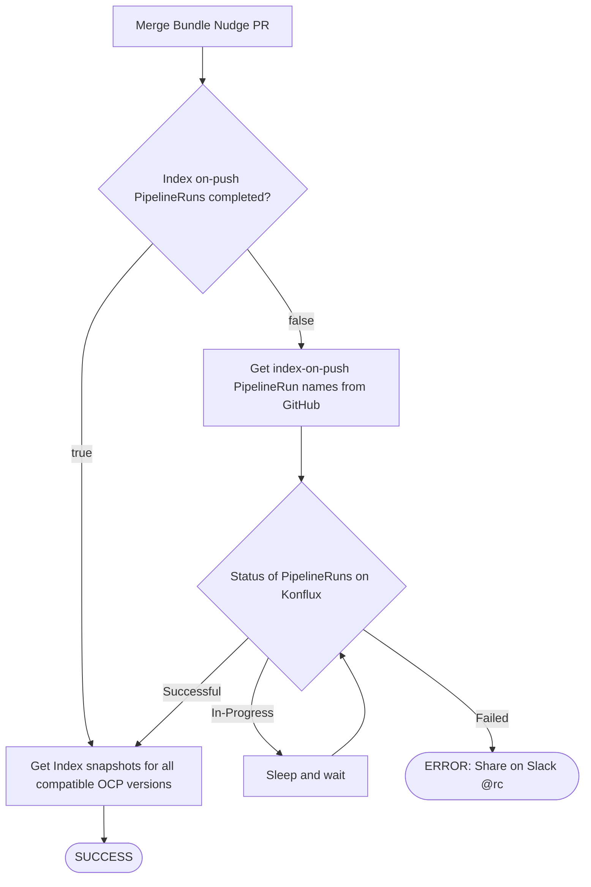
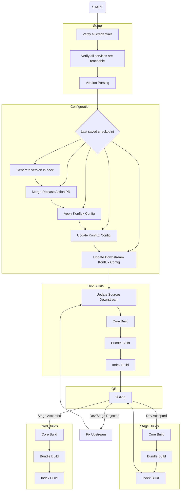

# Release Steps

## Setup

### Verify all credentials (verify_creds)
Check for the presence of `.env` file and verify that all credentials are valid by making a request to a service endpoint.

**No checkpointing**, run every time when CRA is invoked.

### Verify all services are reachable (verify_services)
Check if all services are reachable.

### Version Parsing (version_parsing)

#### Inputs
- release_version: x.y.{z}
  - patch version z can be treated as optional, for example, `1.25` is a valid release_version

#### Outputs
- major: x
- minor: y
- patch: z
- is_minor: z == 0 || z == nil
- release_version

---
## Config
### Generate version in hack (hack_ver_gen)
Even though this is an idempotent step, we can checkpoint this and skip this step after it has beenb run/verified once.
Only needs to be rerun if `hack_ver_gen_completed` has ERROR value and some manual fix/changes were done by the p12n team.

#### Inputs
- major
- minor
- patch
- is_minor

#### Outputs
- hack_ver_gen_completed: SUCCESS/ERROR

#### Notes
- Checkpoint: yes
  - Once the stage has been run/verified successfully once, we can skip verifying again.
  - Error at this stage implies an issue in `hack` config which needs to be fixed manually

### Merge Release Action PR (merge_release_action)
#### Inputs
- hack_ver_gen_completed: should have SUCCESS value
- release_version
- major
- minor
- is_minor

#### Outputs
- merge_release_action_status: SUCCESS/ERROR

#### Notes
- Checkpoint: yes
  - Once the stage has been run/verified successfully once, we can skip verifying again.
  - Error at this stage implies an issue in `hack` config which needs to be fixed manually

### Update Konflux Config (update_konflux_config)
#### Inputs
- merge_release_action_status: should have SUCCESS value

#### Outputs
- update_konflux_config_status: SUCCESS/ERROR

#### Notes
- Checkpoint: yes
  - Once the stage has been run/verified successfully once, we can skip verifying again.
  - Error at this stage implies an issue in `hack` config which needs to be fixed manually

### Apply Konflux Config (apply_konf_config)
#### Inputs
- update_konflux_config_status: should have SUCCESS value

#### Outputs
- apply_konf_config_status: SUCCESS/ERROR

#### Notes
- Checkpoint: yes
  - Once the stage has been run/verified successfully once, we can skip verifying again.
  - Error at this stage implies an issue in `hack` config which needs to be fixed manually

### Update Downstream Konflux Config (ds_update_konf_config)
#### Inputs
- apply_konf_config_status: should have SUCCESS value

#### Outputs
- ds_update_konf_config: SUCCESS/ERROR

#### Notes
- Checkpoint: yes
  - Once the stage has been run/verified successfully once, we can skip verifying again.
  - Error at this stage implies an issue in `hack` config which needs to be fixed manually
- These PRs are merged automatically sowe only need to wait for the merge to happen.
  - The flowchart describes the proper e2e flow which also helps in debugging.

---

## Dev Release
### Update Sources Downstream (ds_update_source)
#### Inputs
- ds_update_konf_config: should have SUCCESS value

#### Outputs
- update_ds_konf_config_status: SUCCESS/ERROR

#### Notes
- These PRs are merged automatically so we only need to wait for the merge to happen.
  - The flowchart describes the proper e2e flow which also helps in debugging.
- This step may need to be run again when new builds are required.

--- 

## Builds
### Core Build (core)
#### Inputs
- ds_update_konf_config: should have SUCCESS value
- env: dev/staging/prod

#### Outputs
- core_{env}_status: SUCCESS/ERROR
- nudge_pr_list
- core_snapshot

#### Notes
- TODO

### Bundle (bundle)
#### Inputs
- core_{env}_status: should have SUCCESS value
- env: should match `core_{env}_status` key
- nudge_pr_list

#### Outputs
- bundle_{env}_status: SUCCESS/ERROR
- bundle_nudge_pr
- bundle_snapshot

#### Notes
- TODO

### Index (index)
#### Inputs
- bundle_{env}_status: should have SUCCESS value
- env: should match `bundle_{env}_status` key
- bundle_nudge_pr

#### Outputs
- index_{env}_status: SUCCESS/ERROR
- index_snapshots

#### Notes
- TODO

---

## End to End Flow

## References
- `hack` repo: https://github.com/openshift-pipelines/hack
-
