## Setup

### Verify all credentials (verify_creds)
Check for the presence of `.env` file and verify that all credentials are valid by making a request to a service endpoint.

**No checkpointing**, run every time when CRA is invoked.

### Verify all services are reachable (verify_services)
Check if all services are reachable.

### Version Parsing (version_parsing)

#### Inputs
- release_version: x.y.{z}
  - patch version z can be treated as optional, for example, `1.25` is a valid release_version

#### Outputs
- major: x
- minor: y
- patch: z
- is_minor: z == 0 || z == nil
- release_version

---
## Config
### Generate version in hack (hack_ver_gen)
Even though this is an idempotent step, we can checkpoint this and skip this step after it has been run/verified once.
Only needs to be rerun if `hack_ver_gen_completed` has ERROR value and some manual fix/changes were done by the p12n team.

#### Inputs
- major
- minor
- patch
- is_minor


#### Outputs
- hack_ver_gen_completed: SUCCESS/ERROR

#### Notes
- Checkpoint: yes
  - Once the stage has been run/verified successfully once, we can skip verifying again.
  - Error at this stage implies an issue in `hack` config which needs to be fixed manually

### Merge Release Action PR (merge_release_action)
#### Inputs
- hack_ver_gen_completed: should have SUCCESS value
- release_version
- major
- minor
- is_minor


#### Outputs
- merge_release_action_status: SUCCESS/ERROR

#### Notes
- Checkpoint: yes
  - Once the stage has been run/verified successfully once, we can skip verifying again.
  - Error at this stage implies an issue in `hack` config which needs to be fixed manually

### Update Konflux Config (update_konflux_config)
#### Inputs
- merge_release_action_status: should have SUCCESS value


#### Outputs
- update_konflux_config_status: SUCCESS/ERROR

#### Notes
- Checkpoint: yes
  - Once the stage has been run/verified successfully once, we can skip verifying again.
  - Error at this stage implies an issue in `hack` config which needs to be fixed manually

### Gitlab konflux-release-data Configuration (glab_rpa_config)
#### Inputs
- update_konflux_config_status: should have SUCCESS value
- release_date

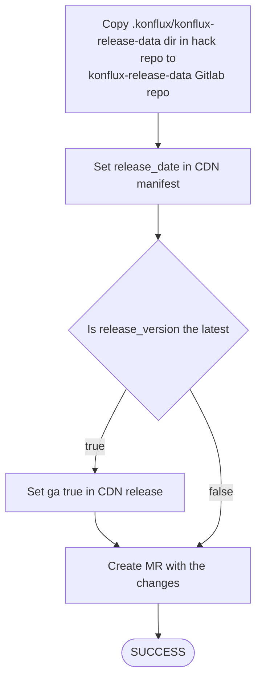

#### Outputs
- mr_link

#### Notes
- Checkpoint: yes

### Apply Konflux Config (apply_konf_config)
#### Inputs
- update_konflux_config_status: should have SUCCESS value

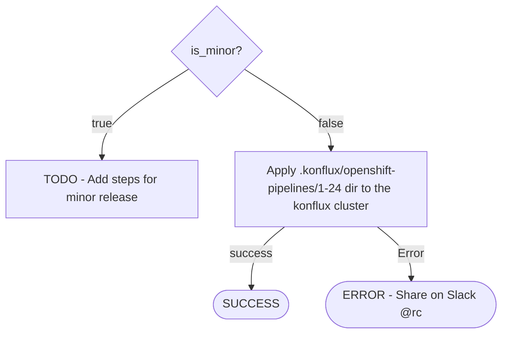

#### Outputs
- apply_konf_config_status: SUCCESS/ERROR

#### Notes
- Checkpoint: yes
  - Once the stage has been run/verified successfully once, we can skip verifying again.
  - Error at this stage implies an issue in `hack` config which needs to be fixed manually


### Update Downstream Konflux Config (ds_update_konf_config)
#### Inputs
- apply_konf_config_status: should have SUCCESS value


#### Outputs
- ds_update_konf_config: SUCCESS/ERROR

#### Notes
- Checkpoint: yes
  - Once the stage has been run/verified successfully once, we can skip verifying again.
  - Error at this stage implies an issue in `hack` config which needs to be fixed manually
- These PRs are merged automatically so we only need to wait for the merge to happen.
  - The flowchart describes the proper e2e flow which also helps in debugging.


### Operator Version Update (operator_version)
#### Inputs
- ds_update_konf_config: should have SUCCESS 
- major, minor, patch
- is_minor

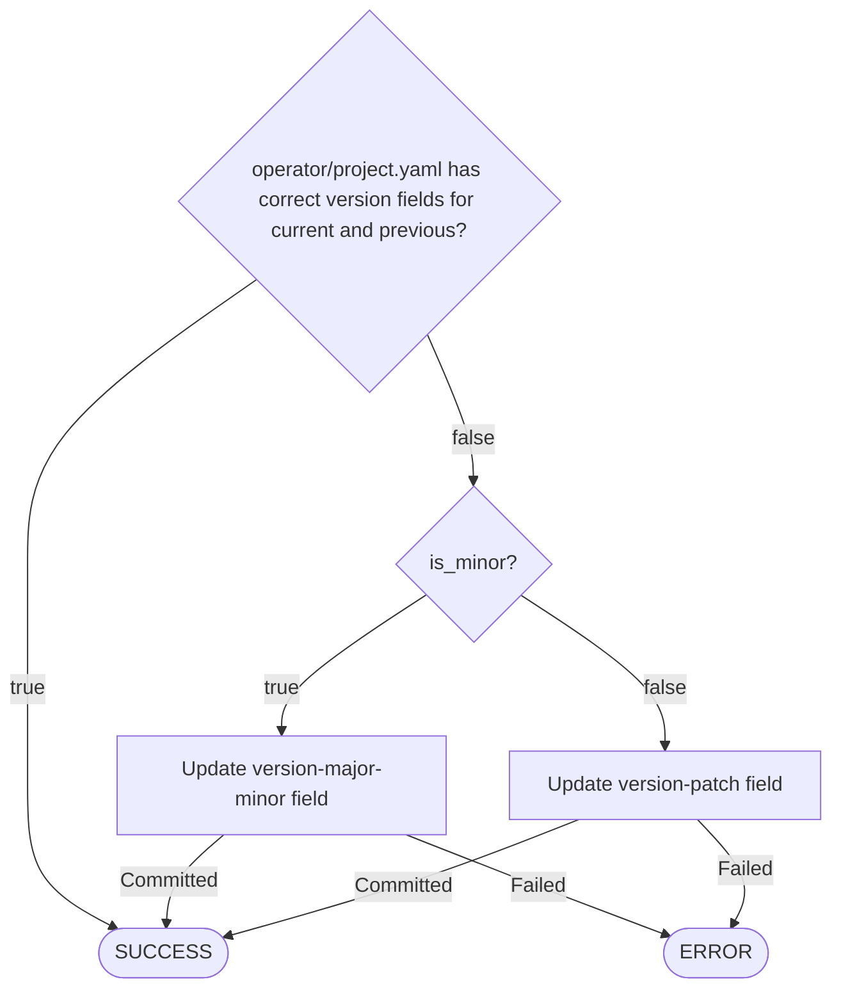

---

## Dev Release
### Update Sources Downstream (ds_update_source)
#### Inputs
- ds_update_konf_config: should have SUCCESS value

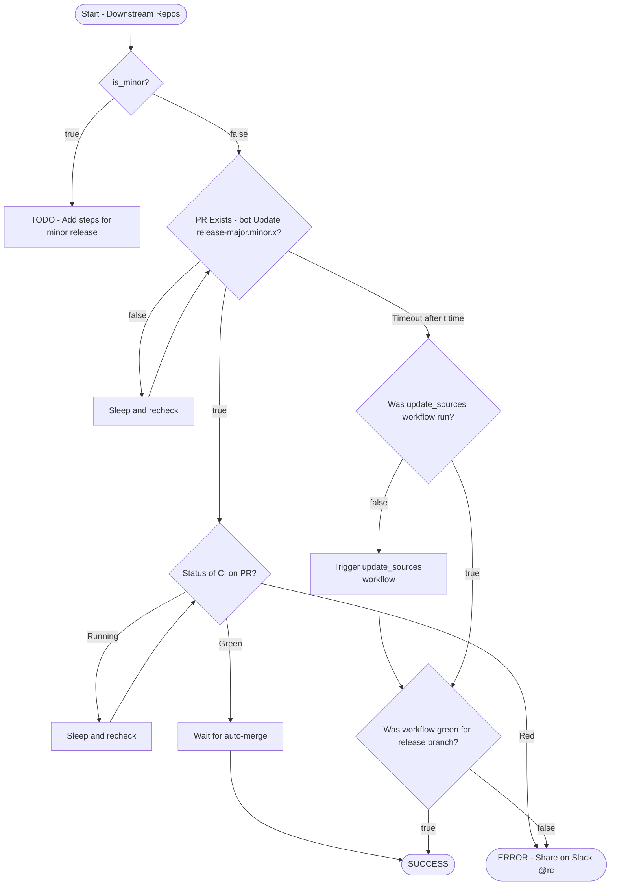
#### Outputs
- update_ds_konf_config_status: SUCCESS/ERROR

#### Notes
- These PRs are merged automatically so we only need to wait for the merge to happen.
  - The flowchart describes the proper e2e flow which also helps in debugging.
- This step may need to be run again when new builds are required.

--- 

## Builds
### Core Build (core)
#### Inputs
- ds_update_konf_config: should have SUCCESS value
- env: dev/staging/prod

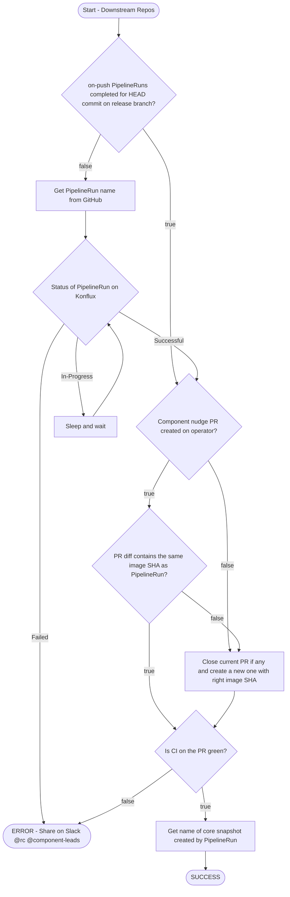

#### Outputs
- core_{env}_status: SUCCESS/ERROR
- nudge_pr_list
- core_snapshot

#### Notes
- TODO

### Bundle (bundle)
#### Inputs
- core_{env}_status: should have SUCCESS value
- env: should match `core_{env}_status` key
- nudge_pr_list


#### Outputs
- bundle_{env}_status: SUCCESS/ERROR
- bundle_nudge_pr
- bundle_snapshot

#### Notes
- TODO

### Index (index)
#### Inputs
- bundle_{env}_status: should have SUCCESS value
- env: should match `bundle_{env}_status` key
- bundle_nudge_pr


#### Outputs
- index_{env}_status: SUCCESS/ERROR
- index_snapshots

#### Notes
- TODO

---

## End to End Flow
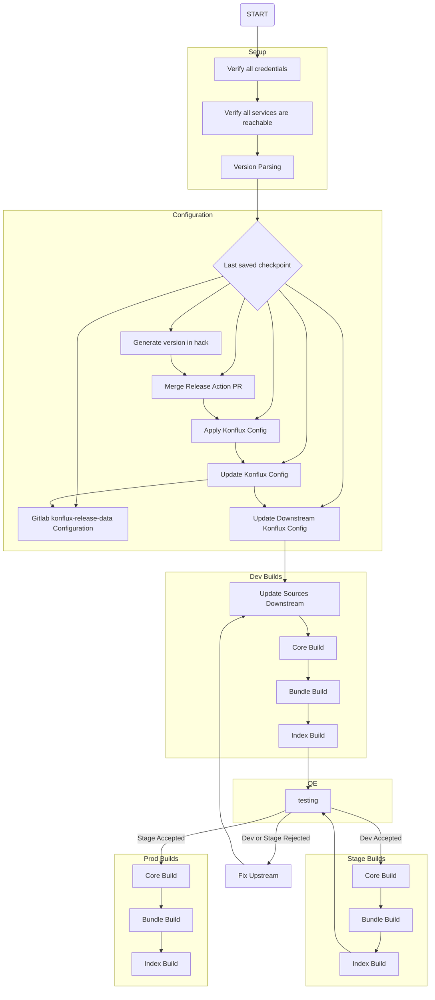

---

## Missing Steps (To Be Integrated)
### Pyxis Configuration (pyxis_config)
#### Inputs
- rpa_config_status: should have SUCCESS or SKIP value
- is_minor

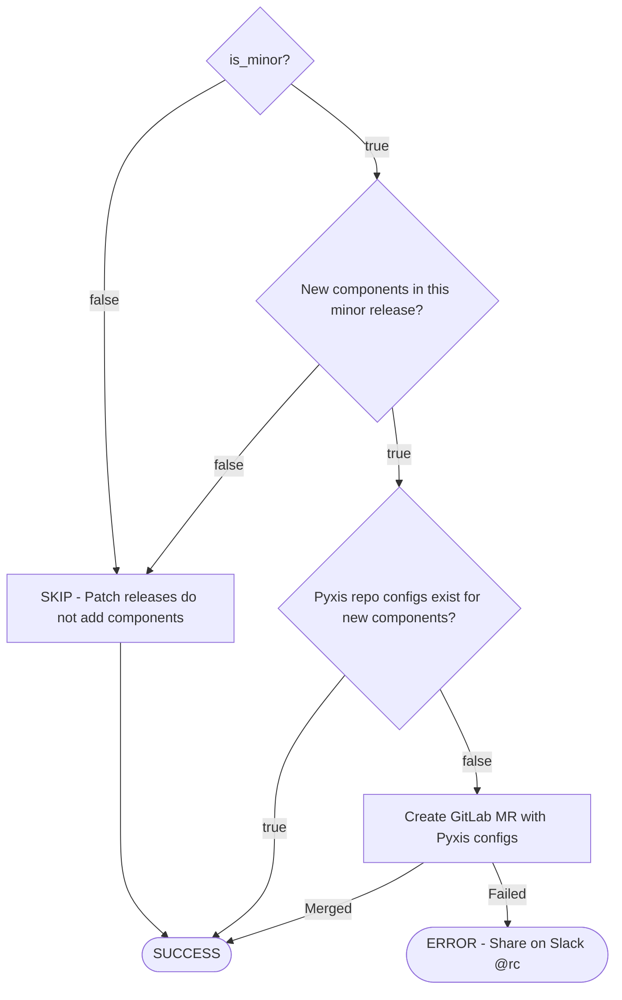

#### Outputs
- pyxis_config_status: SUCCESS/SKIP/ERROR

#### Notes
- Checkpoint: yes
- Usually SKIP for patch releases (no new components)
- Only needed when new images/components added
- GitLab repo: releng/pyxis-repo-configs


#### Outputs
- operator_version_status: SUCCESS/ERROR

#### Notes
- Checkpoint: yes
- Fields used by Konflux for image tagging
- Minor: updates `version-major-minor`, Patch: updates `version-patch`

### OPC Version Update (opc_version)
#### Inputs
- operator_version_status: should have SUCCESS value
- is_minor

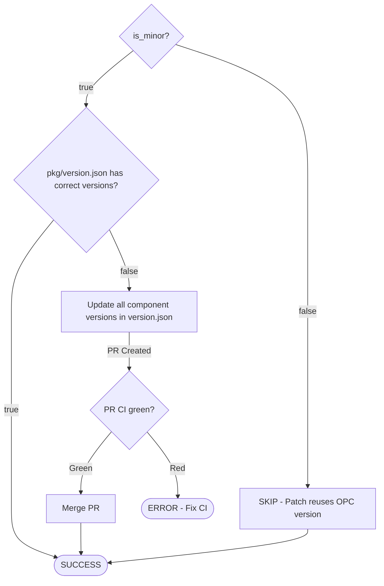

#### Outputs
- opc_version_status: SUCCESS/SKIP/ERROR

#### Notes
- Checkpoint: yes
- Minor releases only (major version bumps for components)
- Updates pkg/version.json for pac, tkn, results, etc.
- Requires GITHUB_USER and GITHUB_EMAIL for automated commits

### Configure CLI Release Infrastructure (configure_cli_release)
#### Inputs
- opc_version_status: should have SUCCESS or SKIP value
- release_version
- release_branch

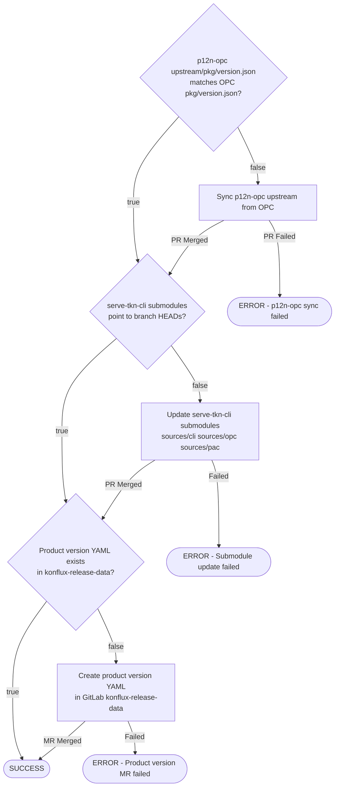

#### Outputs
- configure_cli_release_status: SUCCESS/ERROR

#### Notes
- Checkpoint: yes (checkpoints after each substep)
- Required for ALL releases (both minor and patch)
- Sequential flow (based on cli-release skill):
  1. **p12n-opc sync**: Compare `upstream/pkg/version.json` in p12n-opc with `pkg/version.json` in OPC on release branch. Sync if different.
  2. **serve-tkn-cli submodules**: Validate git submodules (sources/cli → tektoncd/cli, sources/opc → openshift-pipelines/opc, sources/pac → openshift-pipelines/pipelines-as-code) point to their branch HEADs. Update with `git submodule update --init --remote --force --checkout` if outdated.
  3. **Product version**: Ensure `data/external/developer-portal/openshift-pipelines/{VERSION}.yaml` exists in GitLab konflux-release-data with correct versionName, ga flag, releaseDate.
- GitLab repo: https://gitlab.cee.redhat.com/releng/konflux-release-data
- **IMPORTANT**: Product version YAML must exist before RP/RPA can be created (next step dependency)


### OLM Catalog Render (olm_catalog_render)
#### Inputs
- bundle_{env}_status: should have SUCCESS value
- env: dev/staging/production

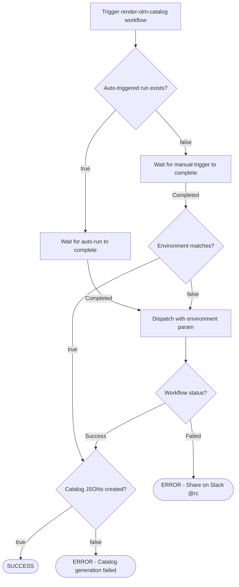

#### Outputs
- olm_catalog_render_{env}_status: SUCCESS/ERROR

#### Notes
- Checkpoint: yes
- Auto-triggers on bundle.yaml changes but with wrong environment (devel)
- Must dispatch manually with correct environment parameter (dev/staging/production)
- Generates File-Based Catalog JSONs required for index builds

### Code Freeze (code_freeze)
#### Inputs
- index_staging_status: should have SUCCESS value

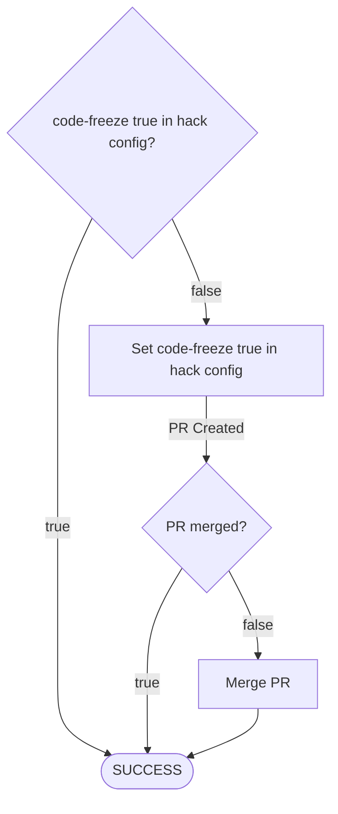

#### Outputs
- code_freeze_status: SUCCESS/ERROR

#### Notes
- Checkpoint: yes
- Done after staging builds complete
- Prevents accidental upstream syncs during release
- Disables update-sources workflow

### Stage Release (stage_release)
#### Inputs
- index_dev_status: should have SUCCESS value
- core_snapshot, bundle_snapshot, index_snapshots

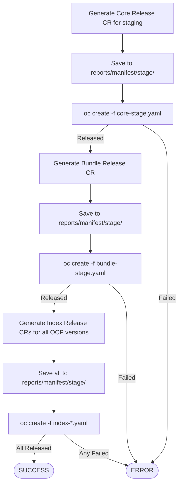

#### Outputs
- stage_release_status: SUCCESS/ERROR
- stage_core_release, stage_bundle_release, stage_index_releases

#### Notes
- Checkpoint: yes
- **Hard ordering:** core → bundle → index (sequential, never parallel)
- Save all manifests before applying (for audit trail)
- Wait up to 5 minutes per release, continue if pending
- Release CRs use `generateName` (apply with `oc create`, not `oc apply`)

---

### Production Release (prod_release)
#### Inputs
- stage_release_status: should have SUCCESS value
- STAGE_CORE_SNAPSHOT: from staging (MUST reuse, not pick new one)

#### Flow
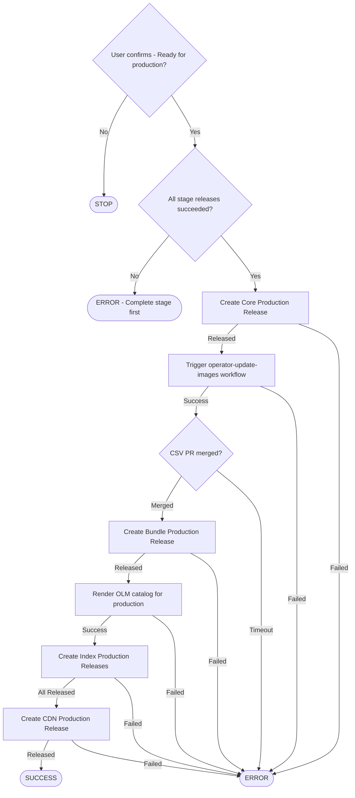

#### Key Steps

1. **Core Production Release**
   - MUST reuse STAGE_CORE_SNAPSHOT (verified in Step 4.1)
   - Do NOT pick latest snapshot

2. **CSV Update**
   - Trigger `operator-update-images` workflow with `environment=production`
   - Wait for auto-generated PR
   - Verify production registry references
   - Merge PR

3. **Bundle Production Release**
   - Bundle rebuilds with production CSV
   - Wait for new bundle snapshot
   - Create Bundle Release CR

4. **OLM Catalog Render**
   - Dispatch `render-olm-catalog` with `environment=production`
   - Generates catalog JSONs

5. **Index Production Releases**
   - One per OCP version
   - Wait for index snapshots
   - Create Index Release CRs

6. **CDN Production Release**
   - Releases CLI binaries to CDN
   - Creates Release CR for serve-tkn-cli

#### Outputs
- prod_release_status: SUCCESS/ERROR
- prod_core_release, prod_bundle_release, prod_index_releases, prod_cdn_release

#### Notes
- **User gate required** before starting
- **Snapshot reuse critical** for core (same bits tested in stage)
- **Hard ordering:** core → CSV → bundle → catalog → indexes → CDN

---

### Image Copy to Quay (image_copy_quay)
#### Inputs
- stage_index_releases: list of stage index Release CRs

#### Flow
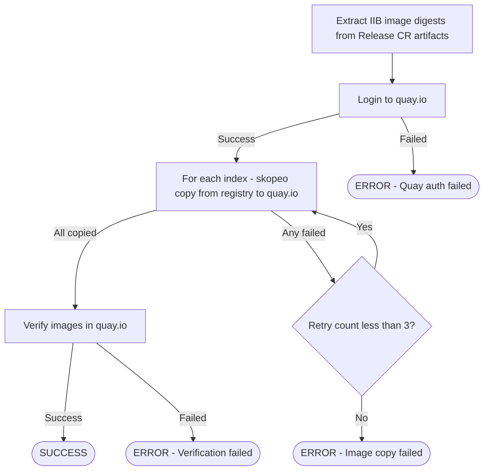

#### Execute
```bash
# Login to Quay
echo "$QUAY_PASSWORD" | skopeo login quay.io -u "$QUAY_USERNAME" --password-stdin

# For each index release, extract IIB digest
IIB_DIGEST=$(oc get release ${RELEASE_NAME} -n ${KONFLUX_NS} \
  -o jsonpath='{.status.artifacts.iib-images[0].digest}')

# Copy to Quay
skopeo copy --all --preserve-digests \
  docker://registry.redhat.io/...@${IIB_DIGEST} \
  docker://quay.io/openshift-pipeline/pipelines-index-${OCP}:v${VERSION}-stage
```

#### Outputs
- image_copy_quay_status: SUCCESS/ERROR
- copied_images: list of quay.io URLs

#### Notes
- Temporary step for QE testing (stage images)
- Uses skopeo for multi-arch copy
- May need VPN for registry access
- Fallback: generate copy script if skopeo unavailable

---

## References
- `hack` repo: https://github.com/openshift-pipelines/hack
- `operator` repo: https://github.com/openshift-pipelines/operator
- `opc` repo: https://github.com/openshift-pipelines/opc
- `p12n-opc` repo: https://github.com/openshift-pipelines/p12n-opc
- `serve-tkn-cli` repo: https://github.com/openshift-pipelines/serve-tkn-cli
- GitLab konflux-release-data: https://gitlab.cee.redhat.com/releng/konflux-release-data
- GitLab pyxis-repo-configs: https://gitlab.cee.redhat.com/releng/pyxis-repo-configs
